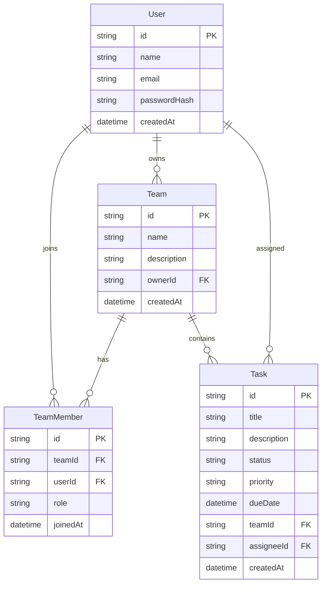

# TaskHub — Task & Team Management

Public task list for Assignment 1. Anyone can create, view, update, and delete tasks without logging in. Teams and authentication are placeholders for later assignments.

## Links

- GitHub: this repository
- Live site (Vercel): _add the production URL after deploy_

## Features (Assignment 1)

- Homepage with app intro, navigation, create/edit/delete tasks
- REST API backed by Prisma and PostgreSQL (Supabase)
- Status filter and required-title validation
- Shared header/footer layout, Teams and Login “Coming soon” pages

## Tech stack

- Next.js (App Router, TypeScript)
- Prisma ORM 6
- PostgreSQL on Supabase
- Tailwind CSS
- Vercel hosting

## Environment variables

Copy [`.env.example`](.env.example) to `.env` and fill in values from Supabase.

| Variable | Purpose |
| --- | --- |
| `DATABASE_URL` | Transaction pooler (port **6543**) for the running app. Append `pgbouncer=true`. |
| `DIRECT_URL` | Direct DB (port **5432**) for Prisma migrations. Use the session pooler on 5432 if IPv6 fails. |

Never commit `.env`.

## Local setup

```bash
cp .env.example .env
# paste your Supabase URLs into .env
npm install
npx prisma migrate deploy
npm run dev
```

Open [http://localhost:3000](http://localhost:3000).

Optional: inspect tables and seed a few rows with Prisma Studio:

```bash
npx prisma studio
```

## API

| Method | Path | Description |
| --- | --- | --- |
| GET | `/api/tasks` | List tasks (`?status=TODO\|IN_PROGRESS\|DONE` optional) |
| POST | `/api/tasks` | Create a task |
| PUT | `/api/tasks/:id` | Update a task |
| DELETE | `/api/tasks/:id` | Delete a task |

## Prisma schema (tables)

- **User** — id, name, email, passwordHash, createdAt
- **Team** — id, name, description, ownerId, createdAt
- **TeamMember** — id, teamId, userId, role, joinedAt
- **Task** — id, title, description, status, priority, dueDate, teamId, assigneeId, createdAt

`Task.teamId` and `Task.assigneeId` are optional in Assignment 1.

### Entity relationship diagram



## Supabase setup

1. Create a free project at [supabase.com](https://supabase.com).
2. Open **Project Settings → Database**.
3. Copy **Transaction pooler** URI → `DATABASE_URL` (port 6543, add `?pgbouncer=true&sslmode=require`).
4. Copy **Direct connection** URI → `DIRECT_URL` (port 5432). If connect fails on IPv4-only networks, use **Session pooler** on port 5432 instead.
5. Run `npx prisma migrate deploy` (or `npx prisma migrate dev --name init` on a fresh database).
6. Confirm tables `User`, `Team`, `TeamMember`, and `Task` in the Table Editor.

Prisma connects as the database user and can manage rows even if you enable Row Level Security to lock down the Supabase Data API.

## GitHub Actions

The workflow in [`.github/workflows/ci.yml`](.github/workflows/ci.yml) runs lint and `next build` on every push and pull request.

1. Push this repository to GitHub (public, as required).
2. Open the **Actions** tab and enable workflows if GitHub asks.
3. Dummy `DATABASE_URL` values are set in the workflow so `prisma generate` and the build can run without a live database.

## Vercel deploy

1. Import this GitHub repo in [Vercel](https://vercel.com).
2. Add `DATABASE_URL` and `DIRECT_URL` in **Project Settings → Environment Variables** (Production, Preview, Development).
3. Deploy. After the first deploy, run migrations against production once:

```bash
npx prisma migrate deploy
```

(with the same production URLs in your local `.env`, or via a one-off Vercel command)

4. Open the production URL and confirm the homepage task list works without login.

## Scripts

| Script | Command |
| --- | --- |
| Dev | `npm run dev` |
| Lint | `npm run lint` |
| Format | `npm run format` |
| Build | `npm run build` |
