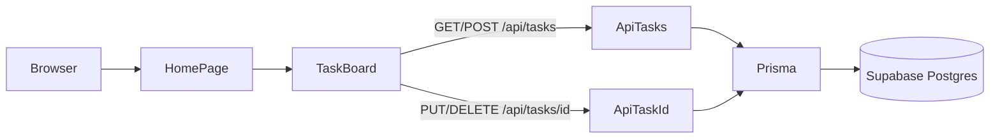

# Assignment 1 – Task & Team Management (setup, Prisma, CRUD, deploy)

## Hiện trạng repo

Đã có Next.js 16 (App Router, TypeScript), Tailwind 4, ESLint, `.gitignore`, Git đã init. **Chưa có** Prisma, Prettier, `.env.example`, API, UI CRUD.

File quan trọng sẵn có: [`package.json`](package.json), [`app/layout.tsx`](app/layout.tsx), [`app/page.tsx`](app/page.tsx), [`.gitignore`](.gitignore).

**Không** `git init` lại. **Không** làm file `QE…_Ass1.docx`.

**Prisma:** pin **Prisma 6** (`prisma` + `@prisma/client` ^6) để khớp đề (`npx prisma init`, `url` + `directUrl` trong `schema.prisma`). Prisma 7 đổi sang `prisma.config.ts` + driver adapter — dễ lệch rubric.

Sửa [`.gitignore`](.gitignore): hiện ignore `.env*` nên **không commit được** `.env.example`. Đổi thành ignore `.env`, `.env.local`, `.env*.local` và `!.env.example`.

---

## 1. Scaffolding, Prettier, env (commit 1)

- Thêm Prettier + `eslint-config-prettier`; file `.prettierrc` / `.prettierignore`; script `format`.
- Tạo [`.env.example`](.env.example):

```
DATABASE_URL=
DIRECT_URL=
```

- Cấu trúc: `app/`, `components/`, `lib/`, `prisma/`.
- Commit: `chore: add prettier, env example, and project structure`

Bạn tạo file `.env` local (không commit) sau khi có connection string Supabase.

---

## 2. Prisma schema + client (commit 2)

`npx prisma init` rồi định nghĩa models (enums cho status/priority/role). `teamId` / `assigneeId` **optional**. User lưu `passwordHash` (chuẩn bị Assignment 2, chưa auth).

```prisma
datasource db {
  provider  = "postgresql"
  url       = env("DATABASE_URL")
  directUrl = env("DIRECT_URL")
}

model User {
  id           String       @id @default(cuid())
  name         String
  email        String       @unique
  passwordHash String
  createdAt    DateTime     @default(now())
  ownedTeams   Team[]       @relation("TeamOwner")
  memberships  TeamMember[]
  assignedTasks Task[]      @relation("TaskAssignee")
}

model Team {
  id          String       @id @default(cuid())
  name        String
  description String?
  ownerId     String
  createdAt   DateTime     @default(now())
  owner       User         @relation("TeamOwner", fields: [ownerId], references: [id])
  members     TeamMember[]
  tasks       Task[]
}

model TeamMember {
  id       String   @id @default(cuid())
  teamId   String
  userId   String
  role     Role     @default(MEMBER)
  joinedAt DateTime @default(now())
  team     Team     @relation(fields: [teamId], references: [id], onDelete: Cascade)
  user     User     @relation(fields: [userId], references: [id], onDelete: Cascade)
  @@unique([teamId, userId])
}

model Task {
  id          String     @id @default(cuid())
  title       String
  description String?
  status      TaskStatus @default(TODO)
  priority    Priority   @default(MEDIUM)
  dueDate     DateTime?
  teamId      String?
  assigneeId  String?
  createdAt   DateTime   @default(now())
  team        Team?      @relation(fields: [teamId], references: [id], onDelete: SetNull)
  assignee    User?      @relation("TaskAssignee", fields: [assigneeId], references: [id], onDelete: SetNull)
}

enum TaskStatus { TODO IN_PROGRESS DONE }
enum Priority   { LOW MEDIUM HIGH }
enum Role       { OWNER MEMBER }
```

- Singleton Prisma Client: [`lib/prisma.ts`](lib/prisma.ts)
- Script `postinstall`: `prisma generate` (cần cho Vercel + CI)
- Sau khi bạn dán URL vào `.env`: `npx prisma migrate dev --name init`

Commit (schema + client, **không** secret): `feat: add prisma schema for users, teams, and tasks`

---

## 3. API Route Handlers (commit 3)

Next.js 16: `params` là `Promise` — phải `await`.

| Method | File | Việc |
|---|---|---|
| GET/POST | [`app/api/tasks/route.ts`](app/api/tasks/route.ts) | list / create |
| PUT/DELETE | [`app/api/tasks/[id]/route.ts`](app/api/tasks/[id]/route.ts) | update / delete |

- GET hỗ trợ query `?status=` (bonus filter).
- POST/PUT: title bắt buộc; `teamId`/`assigneeId` không gửi từ form Ass1.
- 404 nếu task không tồn tại.

Commit: `feat: add public task CRUD API routes`

---

## 4. UI: layout, homepage CRUD, Teams (commit 4–5)



- Shared layout: Header (nav **Home**, **Teams** → `/teams`, **Login** → `/login` placeholder) + Footer trong [`app/layout.tsx`](app/layout.tsx).
- [`app/page.tsx`](app/page.tsx): tên app, mô tả ngắn, form Create, bảng/list task (Edit/Delete). Client component fetch API; sau create/update/delete **refresh list không reload**.
- Bonus: title required (client); filter status (All / To Do / In Progress / Done).
- Responsive Tailwind (đã có trong project) — không thêm shadcn để giữ nhẹ.
- [`app/teams/page.tsx`](app/teams/page.tsx): “Coming soon”.
- [`app/login/page.tsx`](app/login/page.tsx): placeholder (nav không gãy; chưa auth).

Commits:
- `feat: add shared layout and public task CRUD on homepage`
- `feat: add teams and login coming soon pages`

---

## 5. CI + README/ERD (commit 6–7)

- [`.github/workflows/ci.yml`](.github/workflows/ci.yml): `npm ci` → `prisma generate` → `lint` → `next build`. Dummy `DATABASE_URL`/`DIRECT_URL` (build không kết nối DB thật).
- README: cách chạy local, env, schema tóm tắt, **ERD Mermaid** (GitHub render thành diagram), link Vercel (bạn dán sau khi deploy).

Commits:
- `ci: add github actions lint and build workflow`
- `docs: update readme with setup notes and schema ERD`

Tối thiểu 5 commit có nghĩa như đề.

---

## Việc bạn làm tay (kèm guideline khi implement)

Agent **không** tạo project Supabase / Vercel hộ được (cần tài khoản). Khi code xong sẽ viết checklist ngắn trong README + chat:

**Supabase**
1. supabase.com → New project (Postgres).
2. **Project Settings → Database → Connection string**.
3. `DATABASE_URL`: **Transaction pooler** port **6543**, thêm `?pgbouncer=true` (và `sslmode=require` nếu chưa có).
4. `DIRECT_URL`: **Direct** port **5432**, hoặc **Session pooler** `:5432` nếu mạng không IPv6.
5. Dán vào `.env` local → `npx prisma migrate dev --name init`.
6. Table Editor / Prisma Studio: xác nhận 4 bảng; thêm vài task mẫu (Studio: `npx prisma studio`).

**GitHub Actions**
1. Repo public (đề yêu cầu).
2. Push branch `main` → tab **Actions** → workflow chạy (không cần secret nếu dùng dummy URL như trên).
3. Nếu repo mới: Settings → Actions → cho phép workflows.

**Vercel**
1. Import GitHub repo.
2. Env: `DATABASE_URL`, `DIRECT_URL` (giống `.env`, không commit).
3. Deploy → homepage CRUD public, không login.
4. Gửi URL production cho README.

**RLS:** Prisma dùng role `postgres` (bypass RLS). Vẫn nên bật RLS trên bảng `public` để Data API không mở CRUD ẩn — Prisma app không bị ảnh hưởng.

---

## Thứ tự thực thi khi bạn approve plan

1. Prettier + gitignore + `.env.example` → commit
2. Prisma 6 schema + `lib/prisma.ts` → commit
3. **Pause ngắn:** bạn paste connection strings → migrate
4. API routes → commit
5. UI layout + CRUD + coming soon → commits
6. GitHub Actions + README/ERD → commits
7. Browser verify homepage CRUD (nếu `next dev` chạy)
8. Guideline Supabase / GitHub Actions / Vercel trong chat
